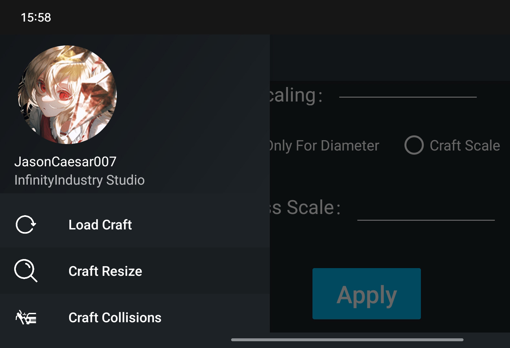
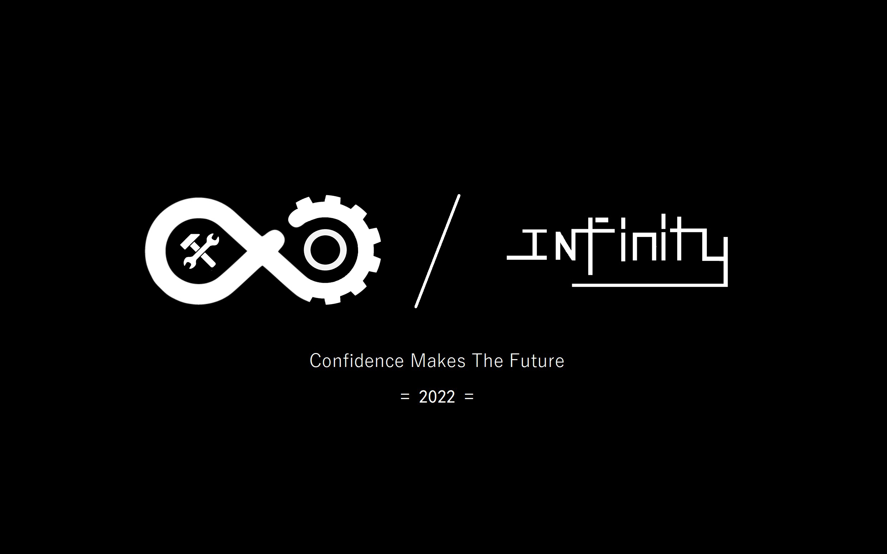

<h1 align="center">SRT 🧰 (SimpleRockets2 Toolkit)</h1>

English | [简体中文](./README.md)

「SR2 Toolkit」It is a muti-platform and multi-functional game toolkit. Most of the functions in this tool need you to download and install the game Simplerockets2 to use.

## 🚀 Download ways

- [GitHub Releases](https://github.com/Server-WX/SR2-Toolkit-for-Android/releases)
- [QQ 群文件](https://jq.qq.com/?_wv=1027&k=x2WxtwUE)
- [Gitee 发行版](https://gitee.com/kinglong-server/SR2-Toolkit-Android/releases/download/1.0/SimpleRockets2_Toolkit.apk)

## ✨ Functions

## 🖥 System requirements

**Windows**

| OS                                                      | Version                    |
| ------------------------------------------------------- | -------------------------- |
| [Windows-client](https://www.microsoft.com/windows/)    | 7 SP1(**\***), 8.1(**\***) |
| [Windows 10 Client](https://www.microsoft.com/windows/) | Version 1607+(**\***)      |
| [Windows-11](https://www.microsoft.com/windows/)        | 2008 R2 SP1(**\***), 2012+ |

**MacOS**

| OS                                       | Version |
| ---------------------------------------- | ------- |
| [MacOS](https://support.apple.com/macos) | 10.15+  |

Download link for PC：[Windows & MacOS](https://www.simplerockets.com/Mods/View/199668/Simple-Rockets-Toolkit)

**Android**

| OS                                            | Version       |
| --------------------------------------------- | ------------- |
| [Android](https://support.google.com/android) | 10.0(API 29)+ |

## ⛔ System not supports

- Windows Server without desktop GUI.
- Linux

## ⌨️ Developing environment

- [JetBrains IntelliJ IDEA](https://www.jetbrains.com/zh-cn/idea/) 2021.2.3 or higher versions
- [Android Studio](https://developer.android.google.cn/studio/) 2021.2.1 or higher versions
- [Oracle JavaSE8](https://www.oracle.com/cn/java/technologies/downloads/#java8)

## 📄 Thanks for the open sources

- [Dom4j](https://dom4j.github.io/)

---

## 📰Disclaimer

This program is promised to be free forever, and we are not responsible if you obtain it through paid means.

## 🔍APP Signature information

- Name: InfinityTechnology
- Organizational Unit: InfinityIndustryStudio
- Country Code: 86

> SHA256: 7D481EA844DF214F2F32F40E40689179E3FC9AFB0D2048292B229FF3DF7CFC2C

<b>Copyright ©2022 InfinityIndustryStudio</b>

