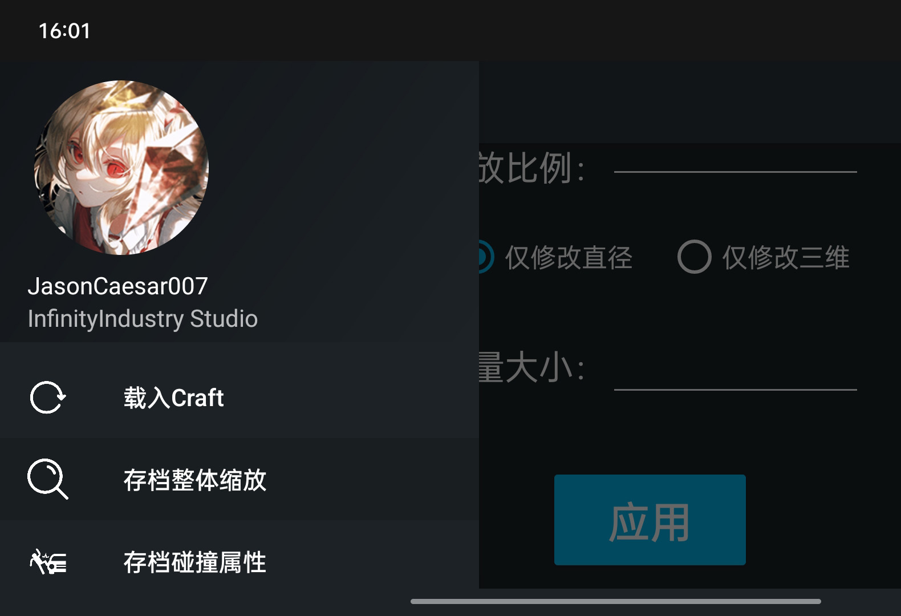

<h1 align="center">SR2 Toolkit 🧰 (简单火箭2工具箱)</h1>

[English](./README.en.md) | 简体中文

「SR2 Toolkit」是一个跨平台的多功能游戏工具箱，此工具的大部分功能都是需要您下载安装 简单火箭2 才能使用。

## 🚀 下载渠道

- [GitHub Releases](https://github.com/Server-WX/SR2-Toolkit-for-Android/releases)
- [QQ 群文件](https://jq.qq.com/?_wv=1027&k=x2WxtwUE)

## ✨ 功能

## 🖥 系统要求

**Windows**

OS                                    | Version                    | 
--------------------------------------|----------------------------
| [Windows-client](https://www.microsoft.com/windows/)    | 7 SP1(**\***), 8.1(**\***) |
| [Windows 10 Client](https://www.microsoft.com/windows/) | Version 1607+(**\***)      |
| [Windows-11](https://www.microsoft.com/windows/)        | 2008 R2 SP1(**\***), 2012+ |

**MacOS**

| OS                                       | Version |
| ---------------------------------------- | ------- |
| [MacOS](https://support.apple.com/macos) | 10.15+  |

PC端下载地址：[Windows & MacOS](https://www.simplerockets.com/Mods/View/199668/Simple-Rockets-Toolkit)

**Android**

| OS                                            | Version       |
| --------------------------------------------- | ------------- |
| [Android](https://support.google.com/android) | 10.0(API 29)+ |

## ⛔ 不受支持的操作系统

- 无桌面 GUI 的Windows Server
- Linux

## ⌨️ 开发环境

- [JetBrains IntelliJ IDEA](https://www.jetbrains.com/zh-cn/idea/) 2021.2.3 或更高版本
- [Android Studio](https://developer.android.google.cn/studio/) 2021.2.1 或更高版本
- [Oracle JavaSE8](https://www.oracle.com/cn/java/technologies/downloads/#java8)

## 📄 感谢以下开源项目

- [Dom4j](https://dom4j.github.io/)

